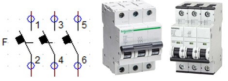
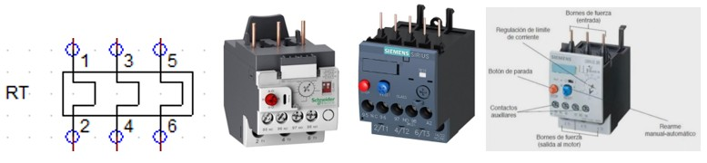
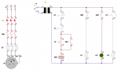

# Programacion PLC

<strong>Contactor:</strong> 

    

<strong>Contactos Auxiliares:</strong> 

    

<strong>Interruptor Automatico:</strong> 

    

<strong>Pulsador:</strong> 

  

    

<strong>Relé Térmico:</strong> 

  

    

<strong>Contacto auxiliar rele termico:</strong> 

  

    

<strong>Bobina:</strong> 

  

    

## Arranque directo motor trifasico
<strong>Esquematico arranque directo:</strong> 
 
