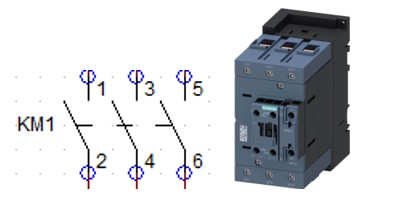
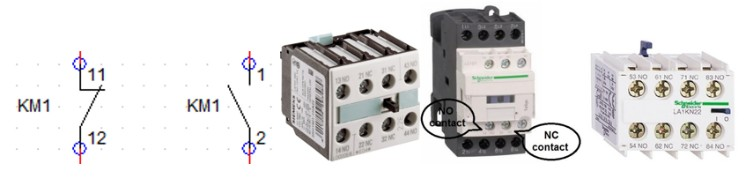
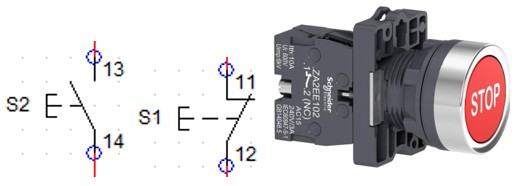
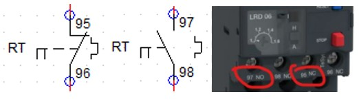
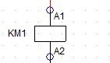
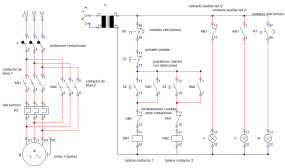

# Programacion PLC
Codigo CADe_Simu: 4962   
## Clase 1 - Introduccion
<strong>Contactor:</strong> 

    

<strong>Contactos Auxiliares:</strong> 

    

<strong>Interruptor Automatico:</strong> 

    

<strong>Pulsador:</strong> 

  

    

<strong>Relé Térmico:</strong> 

  

    

<strong>Contacto auxiliar rele termico:</strong> 

  

    

<strong>Bobina:</strong> 

  

    

## Clase 2 - Armado de arranque directo motor trifasico
<strong>Esquematico arranque directo:</strong> 
 
    

## Clase 3 - Arranque directo e inversion de giro
<strong>Esquematico arranque directo e inversion de giro:</strong> 
 
    

## Clase 4 - Arranque estrella triangulo
<strong>Esquematico arranque estrella triangulo:</strong> 

<strong>Temporizador retardo a conexion:</strong> 
 
    
<strong>Contactores estrella y triangulo:</strong> 
 
 

<strong>Conexion arranque estrella triangulo:</strong> 
 
    

## Clase 5 - PLC Arranque directo

<strong>PLC S7-1200:</strong> 
 
 
 
    
