# Programacion PLC
Simulador diagrmas eléctricos: CADe_Simu  
Codigo Acceso: 4962   
Programa de PLC: TIA Portal 13 (ver a partir de Clase 4)  
Documento con detalles: Programacion PLC.docx  

# Índice
<!-- [Texto visible clickeable](#anchor-que-funciona-como-enlace) El anchor en lugar de espacios, se separa por "-" -->
- [Clase 1 - Introduccion](#clase-1---introduccion)
- [Clase 2 - Armado de arranque directo motor trifasico](#clase-2---armado-de-arranque-directo-motor-trifasico)
- [Clase 3 - Arranque directo e inversion de giro](#clase-3---arranque-directo-e-inversion-de-giro)
- [Clase 4 - Arranque estrella triangulo](#clase-4---arranque-estrella-triangulo)
- [Clase 5 - PLC Arranque directo](#clase-5---plc-arranque-directo)

## Clase 1 - Introduccion
<strong>Contactor:</strong> 

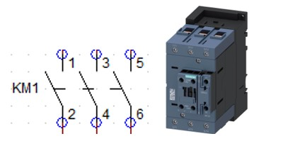

    

<strong>Contactos Auxiliares:</strong> 

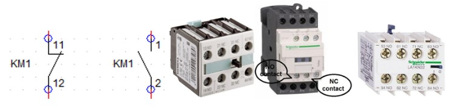

    

<strong>Interruptor Automatico:</strong> 

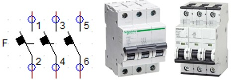

    

<strong>Pulsador:</strong> 

 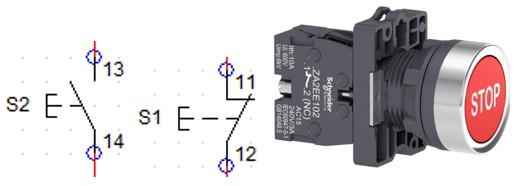 

    

<strong>Relé Térmico:</strong> 

 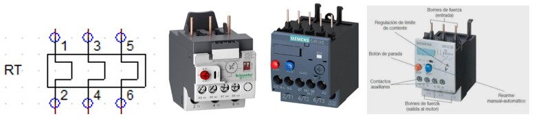 

    

<strong>Contacto auxiliar rele termico:</strong> 

 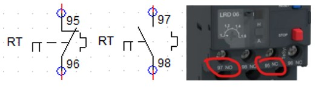 

    

<strong>Bobina:</strong> 

 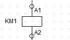 

    

## Clase 2 - Armado de arranque directo motor trifasico
<strong>Esquematico arranque directo:</strong> 
[Programa: CADe_Clase1_arranque_directo](Programas/)  
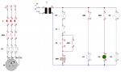 
    

## Clase 3 - Arranque directo e inversion de giro
<strong>Esquematico arranque directo e inversion de giro:</strong> 
[Programa: CADe_Clase3_arranque_directo_e_inversion_giro](Programas/)  
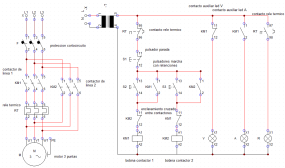 
    

## Clase 4 - Arranque estrella triangulo

<strong>Temporizador retardo a conexion:</strong> 
 
    
<strong>Contactores estrella y triangulo:</strong> 
 
 
<a href="imagenes/4-estrella_triangulo/video_conexion_triangulo_estrella.mp4">Ver video demostración</a>
 

<strong>Conexion arranque estrella triangulo:</strong> 
 
    
<strong>Esquematico arranque estrella triangulo:</strong> 
[Programa: CADe_Clase_4_Estrella_Triangulo](Programas/)  
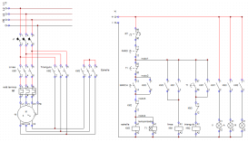 
    

## Clase 5 - PLC Arranque directo
### Configuracion de PLC Siemens 1200
1) Crear Proyecto > Seleccionar Nombre y Ruta
2) Dispositivos y Redes > Agregar dispositivos > S7-1200 el nuestro es CPU 1214ACDCRly > Ver cual es el equipo 6E17 214BE30-0XB0
3) Sobre la imagen del PLC, para bajar los datos hacer doble click en el puerto Profinet y ajustar dirección IP y máscara subred según dispositivo: 
El último dígito depende el dispositivo que use en la red, Ejemplo: 192.168.0.1. Conectar el cable Ethernet.
4) Variables PLC > Tabla de variables: Crear las variables que utilizaré en el proyecto.
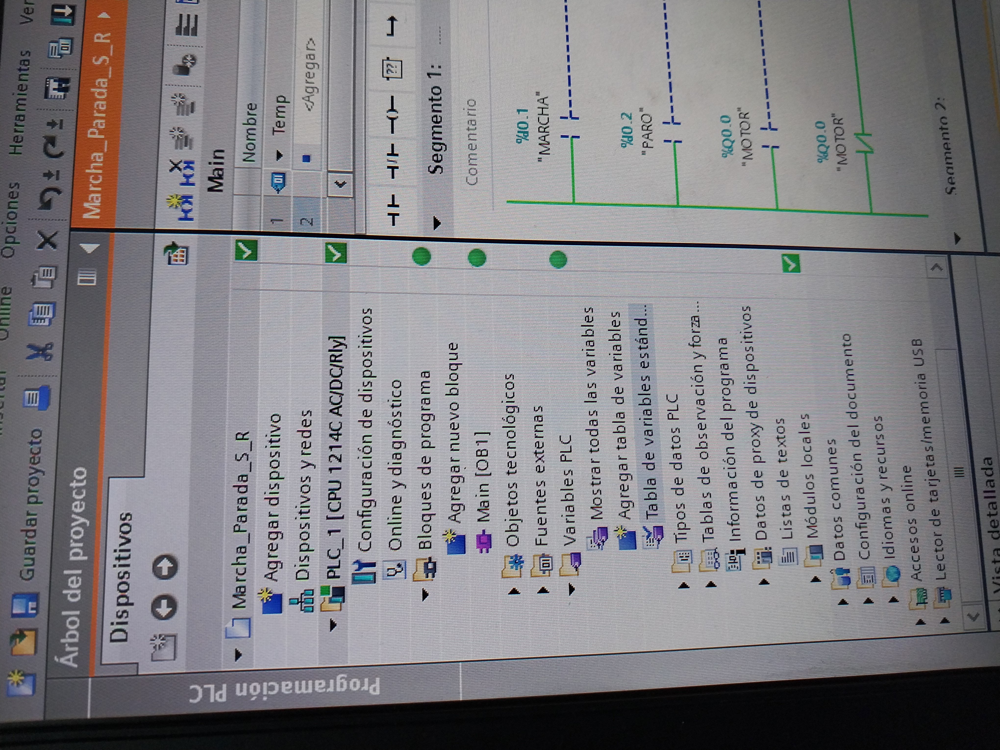 
6) Barra de Herramientas > Cargar dispositivo > Tipo interfaz PN/IE. Cargar información cuando esté en STOP. 
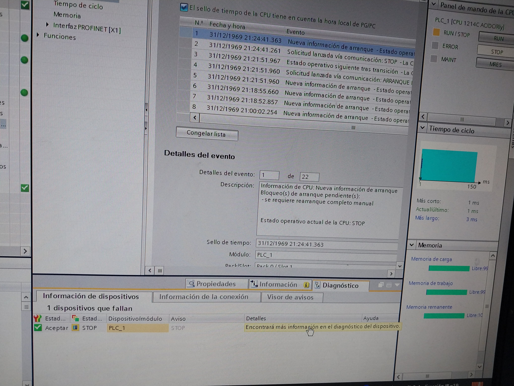 
7) Crear los bloques del programa > Main [OB1]. Siempre tener detenido programa antes de cargarlo. Utilizar "ícono de lentes" para ver ejecución de programa.
  

### PLC Arranque directo
<strong>PLC S7-1200:</strong> 
 
 
 
    

### Funciones Lógicas
Para optimizar diseños también es recomendable utilizar los mapas de Karnaugh.
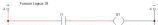 
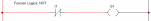 
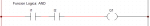 
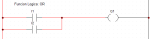 
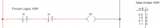 
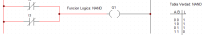 
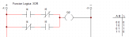 
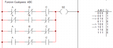 
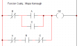 

## Clase 6 - Utilizacion de Memoria, Flancos, Set y Reset
Puede contruirse un "interruptor" con estos elementos:
<a href="imagenes/4-estrella_triangulo/video-mem-set-reset.mp4">Ver video demostración</a>

Esquema CADe SIMU de conexión PLC físico con Set y Reset  
Ejercicio simple con Set y Reset: 
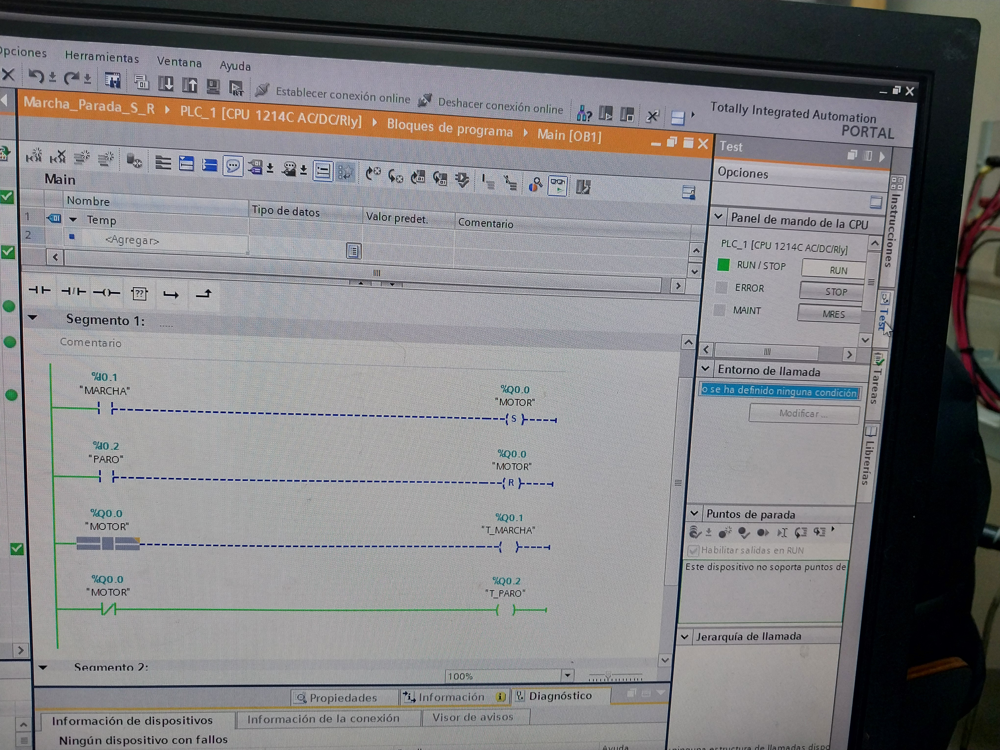 
 
Ejercicio SET y RESET utilizando memoria: 
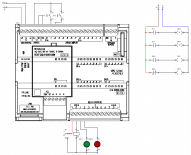 
