# Programacion PLC
Simulador diagramas eléctricos: CADe_Simu  
Codigo Acceso: 4962   
Programa de PLC: TIA Portal 13   
Documento con detalles: Programacion PLC.docx  

# Índice
<!-- [Texto visible clickeable](#anchor-que-funciona-como-enlace) El anchor en lugar de espacios, se separa por "-" -->
- [Clase 1 - Introduccion](#clase-1---introduccion)
- [Clase 2 - Armado de arranque directo motor trifasico](#clase-2---armado-de-arranque-directo-motor-trifasico)
- [Clase 3 - Arranque directo e inversion de giro](#clase-3---arranque-directo-e-inversion-de-giro)
- [Clase 4 - Arranque estrella triangulo](#clase-4---arranque-estrella-triangulo)
- [Clase 5 - PLC Arranque directo](#clase-5---plc-arranque-directo)
- [Clase 6 - Utilizacion de Memoria,Flancos,Set y Reset](#clase-6---utilizacion-de-memoria,flancos,set-y-reset)
- [Clase 7 - Temporizadores](#clase-7---temporizadores)
- [Clase 8 - Machine Expert Basic - Schneider](#clase-8---schneider)
- [Clase 9 - Contadores](#clase-9---contadores)
- [Clase 10 - Variador de velocidad](#clase-10---variador-de-velocidad)

## Clase 1 - Introduccion
<strong>Contactor:</strong> 
Es interruptor electromagnético accionado por medio de bobina. Campo magnético atrae a núcleo y cierra los contactos. Posee contactos de control. Al desenergizarse desaparece campo magnético y resorte devuelve núcleo a posición inicial.
 

  

<strong>Contactos Auxiliares:</strong> 
Ayudan con la lógica del contactor. Se encuentran dentro del propio contactor. Sirven para auto-retemcion y aplicar lógica de enclavamiento. Pueden ser NC (normal cerrado) o NA (normal abierto).
 

  

<strong>Interruptor Automatico:</strong> 
Es un elemento que protege contra cortocircuitos.
- Protección térmica (sobrecarga): Actúa cuando circula corriente superior a la nominal durante tiempo largo.
Dentro de interruptor hay lámina bimetálica con diferente dilatación termica que se deforma al calentarse y acciona el mecanismo. 
- Protección magnética: Cuando la corriente es muy alta el campo magnético también lo es. Se atrae núcleo móvil y se dispara el mecanismo. Los contactos se abren repentinamente en milisegundos. 
Ejemplo: fase y neutro entran en contacto o aparece una corriente muy alta.
No se destruye al actuar. Se rearma al levantar la palanca.
 

  

<strong>Pulsador:</strong> 
Cierra o abre el circuito mientras se mantenga pulsado. Puede ser NC o NA. 
 

  

  

<strong>Relé Térmico:</strong> 
Protege al motor de sobrecargas al detectar sobrecorriente y abre el circuito de control. Si el motor está consumiendo más corriente que la debería puede calentarse y dañarse. Utiliza láminas bimetálicas que se calientan y deforman lentamente, accionando el mecanismo de disparo.
 

  

  

<strong>Contacto auxiliar rele termico:</strong> 

  

  

<strong>Bobina:</strong> 
Asociada a contactores, al energizarse lo cerrará.
 

  

  

## Clase 2 - Armado de arranque directo motor trifasico
<strong>Esquematico arranque directo:</strong> 
[Programa: CADe_Clase1_arranque_directo](Programas/)  
 
  

## Clase 3 - Arranque directo e inversion de giro
<strong>Esquematico arranque directo e inversion de giro:</strong> 
[Programa: CADe_Clase3_arranque_directo_e_inversion_giro](Programas/)  
 
    

## Clase 4 - Arranque estrella triangulo

El motor trifásico es de marca SIEMENS, Modelo: 1MJ6133-4CA60 (trifásico asíncrono) de 85 kg. 
Potencia de motor: 4 kW. 
Frecuencia: 50 Hz. 
Velocidad nominal: 945 rpm (motor de 6 polos) 
Factor de potencia cos(phi): 0,76. 
Tensión nominal: 400/690 V (triangulo/estrella) o rango de 380-420V/660-725 V (triangulo/estrella). 
Corriente nominal: 9,6 A en triangulo / 5,5 A en estrella para 400/690V (y hasta 10 A / 5,8 A en el rango de voltaje extendido). 
 
<strong>Temporizador retardo a conexion:</strong> 
 
    
<strong>Contactores estrella y triangulo:</strong> 
 
 
<a href="imagenes/4-estrella_triangulo/video_conexion_triangulo_estrella.mp4">Ver video demostración</a>
 

<strong>Conexion arranque estrella triangulo:</strong> 
 
    
<strong>Esquematico arranque estrella triangulo:</strong> 
[Programa: CADe_Clase_4_Estrella_Triangulo](Programas/)  
 
    

## Clase 5 - PLC Arranque directo

### Lenguajes Programación PLC (IEC 61131-3)
- Diagrama Ladder (LD)
- Diagrama Bloques Funcionales (FBD)
- GRAFCET: Graficos Funcionales Secuenciales (SFC: Sequential Function Charts)
- Texto Estructurado (ST)
- Lista de Instrucciones (IL)

### Configuracion de PLC Siemens 1200
1) Crear Proyecto > Seleccionar Nombre y Ruta
2) Dispositivos y Redes > Agregar dispositivos > S7-1200 el nuestro es CPU 1214ACDCRly > Ver cual es el equipo 6E17 214BE30-0XB0
3) Sobre la imagen del PLC, para bajar los datos hacer doble click en el puerto Profinet y ajustar dirección IP y máscara subred según dispositivo: 
El último dígito depende el dispositivo que use en la red, Ejemplo: 192.168.0.1. Conectar el cable Ethernet.
4) Variables PLC > Tabla de variables: Crear las variables que utilizaré en el proyecto.
 
6) Barra de Herramientas > Cargar dispositivo > Tipo interfaz PN/IE. Cargar información cuando esté en STOP. 
 
7) Crear los bloques del programa > Main [OB1]. Siempre tener detenido programa antes de cargarlo. Utilizar "ícono de lentes" para ver ejecución de programa.
  

### PLC Arranque directo
<strong>PLC S7-1200:</strong> 
 
 
 
    

### Funciones Lógicas
Para optimizar diseños también es recomendable utilizar los mapas de Karnaugh.
 
 
 
 
 
 
 
 
 

## Clase 6 - Utilizacion de Memoria,Flancos,Set y Reset

Ejercicio simple con Set y Reset:
  
 
  

Puede contruirse un "interruptor" con estos elementos: 

Efecto interruptor: Con un pulsador normal al pulsar y soltar, la señal vuelve a 0. Esta implementación puede "recordar" si el motor debe encender o apagar usando bit "M10.1", que guarda el último estado del motor. 

<a href="imagenes/4-estrella_triangulo/video-mem-set-reset.mp4">Ver video demostración</a>
 

Esquema CADe SIMU de conexión PLC físico con Set y Reset

  
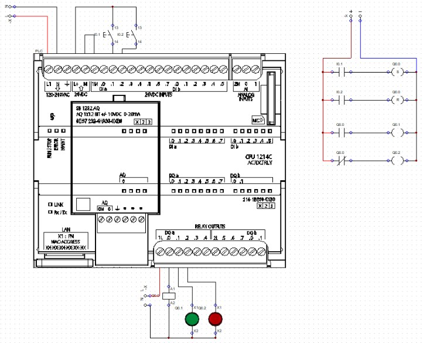
 

Rung 1 y 2: Decide si hacer SET o RESET. 
Rung 1: Flanco & (M_P = 0) entonces SET Motor.
Rung 2: Flanco & (M_P = 1) entonces SET Motor.  

Rung 3: Detectar motor encendido: Cuando MOTOR = 1 se ejecuta SET M_P, entonces M_P = 1  
Rung 4: Detectar motor apagado: Cuando MOTOR = 0 se ejecuta RESET M_P, entonces M_P = 0  

## Clase 7 - Temporizadores

TON: Time On Delay  

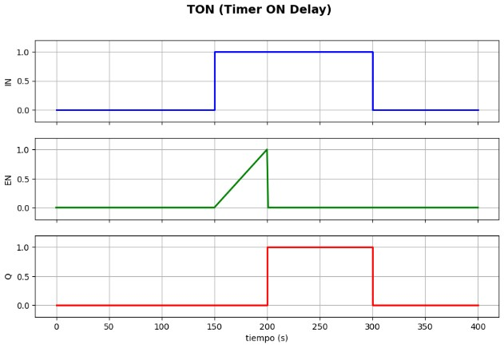

 

TOF: Time Off Delay  

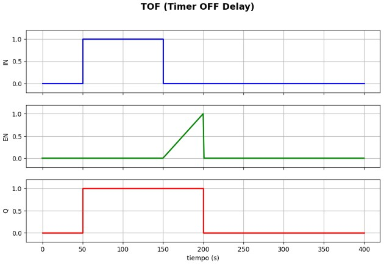

 

TP: Time Pulse  

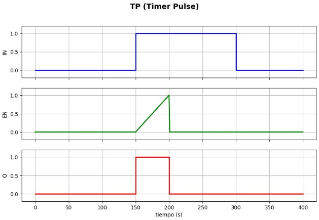

 

En esta clase también se realiza ejercicio de montacargas en TIA Portal:  
El ejercicio consiste en que un motor sube y baja un montacarga entre 3 pisos (SS, PB, 1er piso) utilizando 3 sensores y 3 pulsadores
un sensor y un pulsador por cada piso.

 

## Clase 8 - Machine Expert Basic - Schneider

Utilizacion de Machine Expert - Basic (Schneider Electric) para programar y simular Ladder. En este caso ejercicio de semáforo con timers.  

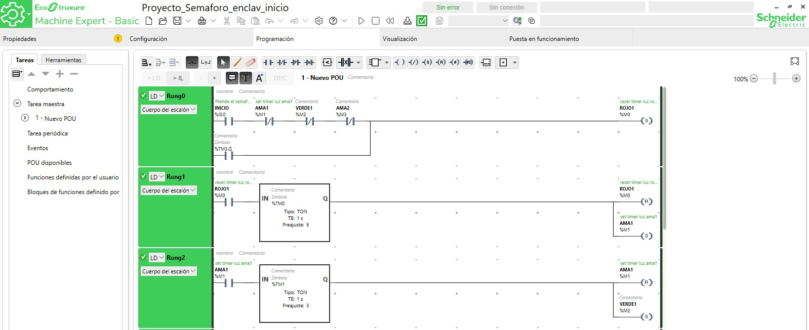

Utilizacion de Veijeo para programar pantallas HMI (HMIGXU3512X 800x480)  

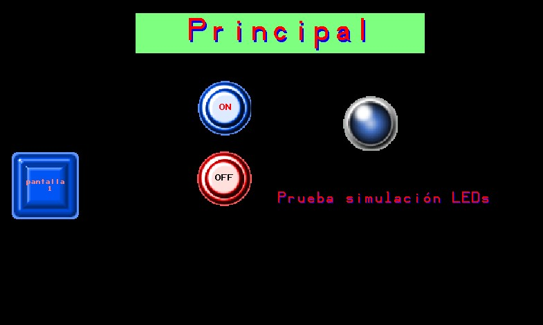

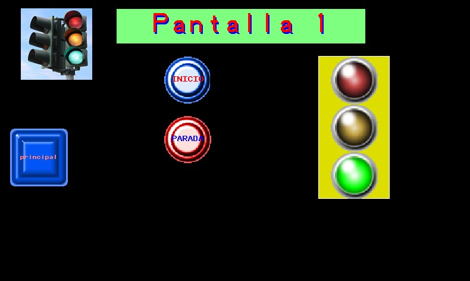

## Clase 9 - Contadores
Introducción a contadores en Schneider y Siemens (ascendentes, descendentes, ambos). 

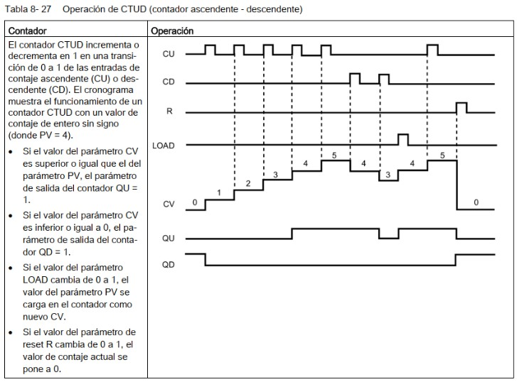

Aplicación en ejercicio de cintas transportadoras. 
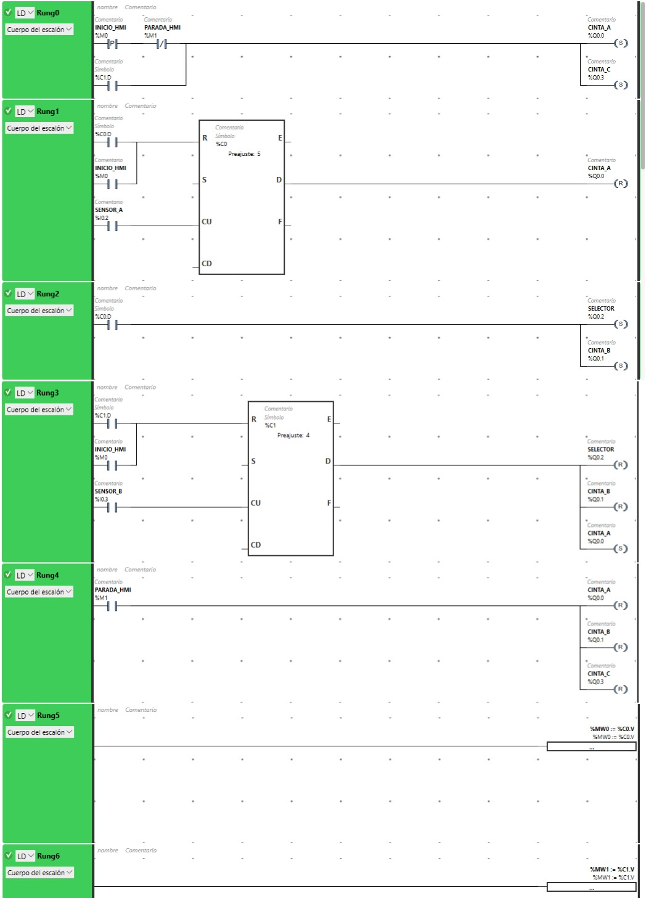

Cintas transportadoras con Veijeo 
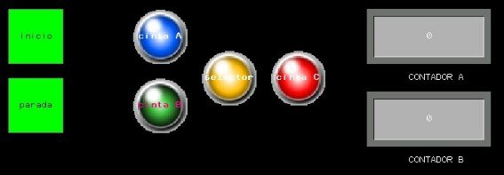

## Clase 10 - Variador de velocidad
Para sistemas trifásicos, mejora las condiciones de arranque. 
El variador utilizado es de marca Synamics G120. Consiste en 3 modulos: Potencia, Control y Operacion. 
Utiliza parametros para ser configurados. 
p700 = BORNES
p701 = CON/DES
p702 = SENTIDO GIRO
p703 = BIT0
p704 = BIT1
p705 = BIT2
p1000 = CONSIGUE VELOCIDAD
p1001 = VELOCIDAD FIJA 1
 
Combinando los BIT tenés 2^3 = 8 posibles velocidades.
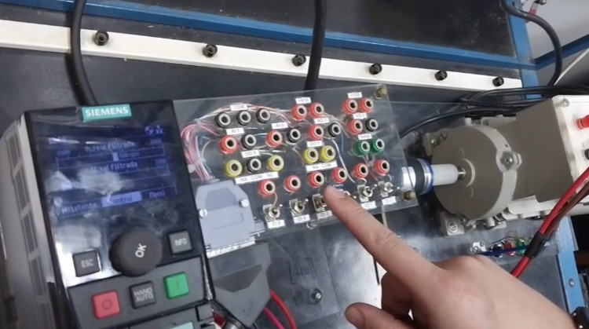

Secuencia temporizada para aumentar velocidad de variador:
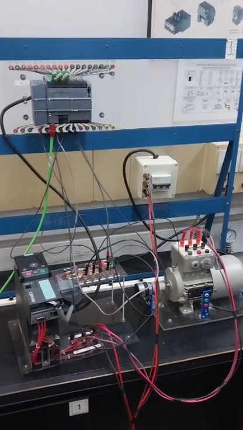

El programa de control activa salidas %Qx.x de forma progresiva hasta que los 3 bits estén activos para alcanzar máxima velocidad y detiene el motor. 
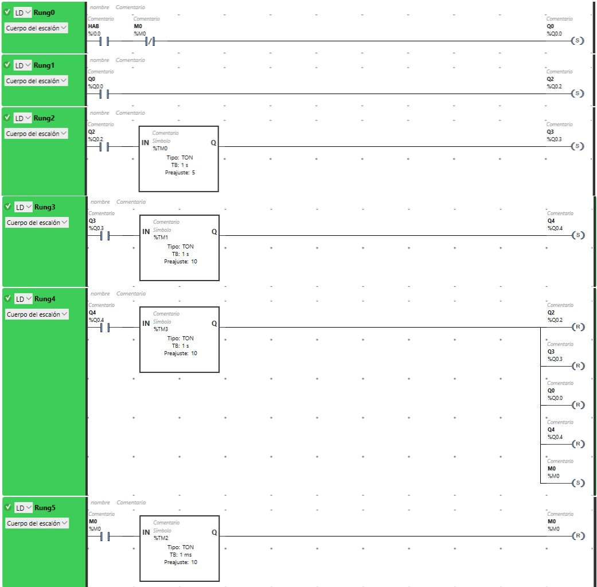

## Clase 11 - HMI Siemens
Utilizamos Switch CSM1277 Simatic para tener conexión Ethernet en simultaneo con PLC S7-1200 y KTP600. 

Configuración de pantalla HMI de 6 pulgadas KTP600 SIMATIC por comunicación Ethernet. 

 

Programa básico para activar salidas e indicarlas con un "led" (circulo) verde o rojo si está activada o no. 
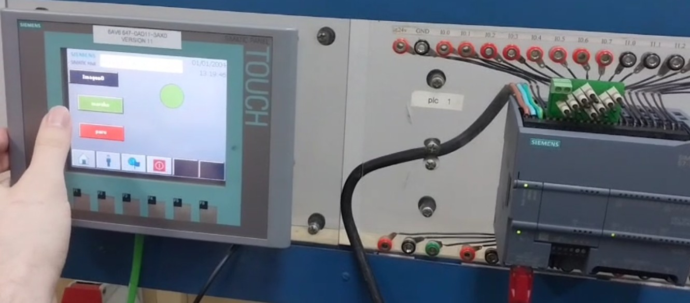

